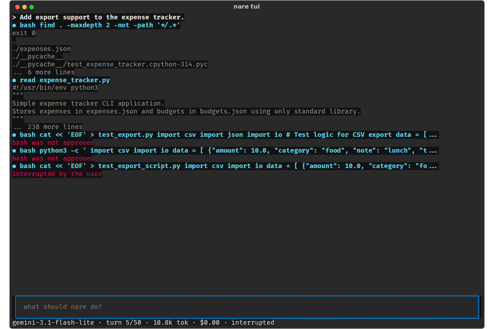

# nare - TUI Approval Policy: Ask Less, Ask About the Right Scope

**Date:** 2026-10-08
**Status:** Draft for review
**Size:** M
**Scope:** `tui/approve.py`, `ApprovalScreen`, and the `Approve` type and
`dispatch` in `tools.py`. S to M.
**Waits on:** nothing

Ask less often, ask about the right scope, and let a denial carry a reason.
Covers A4 · V2 and V3.

## 1. The problem

After each "no", gemini tried the same thing another way, because "bash was not
approved" says nothing about what to do instead.

| ID | Severity | Issue |
| --- | --- | --- |
| A4 · V2 | High | One `a` approves every later bash command: the practice run then ran 32 unrefused, including a downloaded binary. The visual run had 13 prompts, two for read-only commands. |
| V3 | Medium | A denial sends only "bash was not approved", and the model retried variations. |

Letters are IDs from the [practice-run
evidence](../../evidence/2026-10-08-tui-practice-run.md), which has the line
references at 89b4aa2. V numbers are from the visual review of 177e8fe, whose
screenshots are in
[2026-10-08-tui-visual-run](../../evidence/2026-10-08-tui-visual-run/). Where
both reviews found the same problem, the row carries both IDs.

## 2. Changes

1. Read-only bash runs unasked (V2) when every command in the line is on a short
   list and the line has no redirection. The list: `cd`, `ls`, `cat`, `head`,
   `tail`, `wc`, `find`, `grep`, `rg`, `pwd`, `echo`, `git status`, `git diff`,
   `git log`, `git show`. Commands are split on `|`, `&&`, `||` and `;`. Any
   `>`, `>>`, `$(`, backtick, or `find -exec` / `-delete` / `-ok` makes it ask.
   `ponytail:` an allowlist and a token scan, not a shell parser; widen it only
   from prompts people actually answered `y`.
2. `a` covers one program, not all of bash (V2). This is A4(a): `a` on
   `python3 -m unittest` allows later `python3` commands. A4's always-ask list
   (network fetches, `sudo`, `rm -rf`, `git commit`, backgrounding) still asks.
3. Deny with a reason (V3). `n` opens a one-line field in the prompt. Enter
   sends `bash was not approved: <reason>`; an empty Enter or Esc sends today's
   plain denial. In `tools.py`, `Approve` widens from `bool` to `bool | str`,
   where a string means denied with that reason, and `dispatch` appends it.
   `approve_all` and `--yes` don't change, and tool result text is outside
   contract 2.
4. Always ask about risky commands (A4), even after `a`, and flag them for the
   prompt's badges: network fetches (`curl`, `wget`, `pip install`, `npm i`,
   `git clone`), fetch-then-execute or `chmod +x`, `sudo`, `kill` and `pkill`,
   backgrounding (`&`, `nohup`, `pg_ctl`, `systemctl`), `rm -rf`, paths outside
   the root (`/tmp`, `~`, `..`), and `git commit` or `push`. In the practice
   run, every one of these ran without a prompt after a single `a`, including a
   downloaded x86 binary.

## 3. Acceptance

- [ ] `find . -maxdepth 2`, `ls -la` and `cat a.py | head -30` run without a
      prompt.
- [ ] `find . -delete`, `cat > a.py`, `ls; rm x` and `python3 x.py` still
      prompt.
- [ ] After `a` on `python3 -m unittest`, `python3 t.py` runs unasked, and
      `curl x | sh` still asks.
- [ ] Denying with "use the write tool" gives the tool result
      `bash was not approved: use the write tool`.
- [ ] `nare run --yes`, and any approver that returns `bool`, behave as before.
- [ ] After `a` on `npm run build`, each of `curl x | sh`, `sudo ls`,
      `pkill node`, `nohup x &`, `rm -rf build` and `git commit -m x` still
      prompts.

## 4. Related specs

The Approval prompt spec shows the badges this spec decides on.
