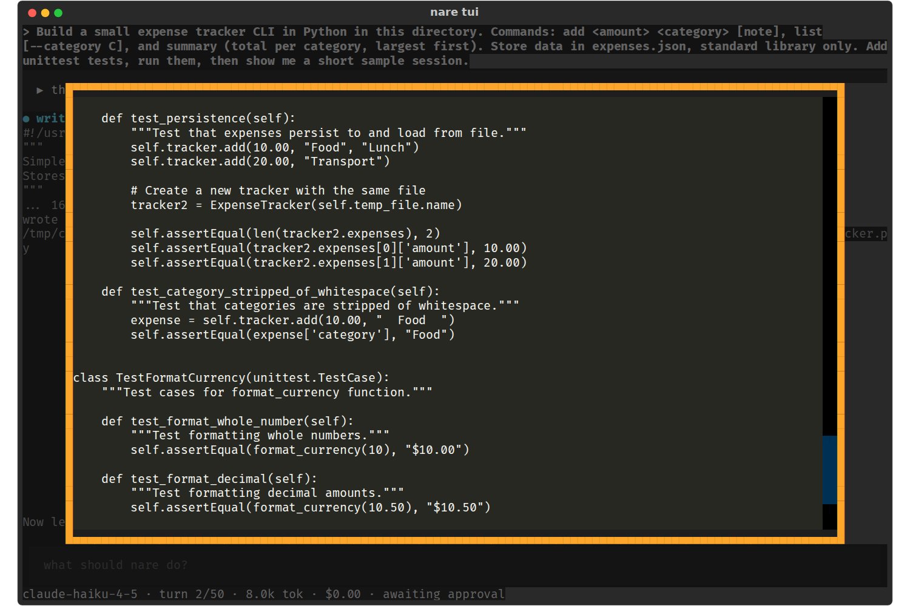
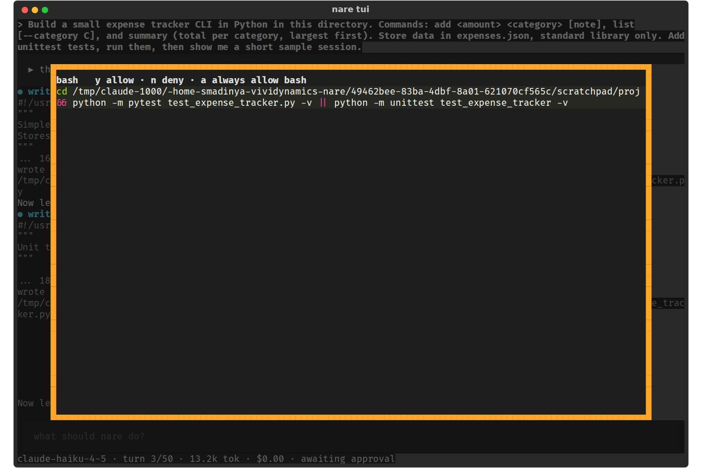
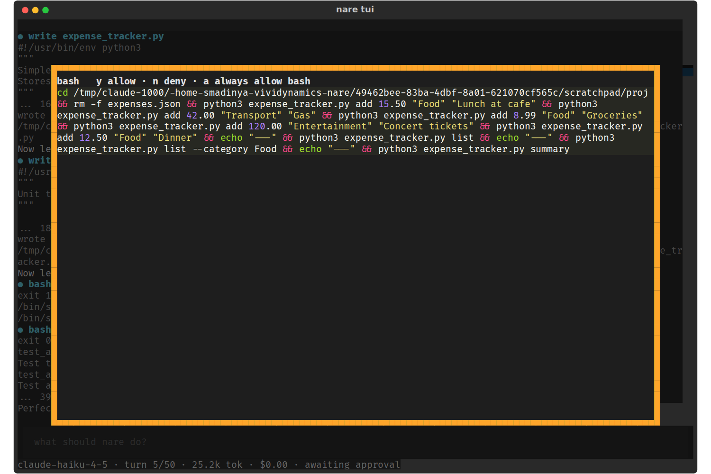

# nare - TUI Approval Prompt: What, How to Answer, Sized to Fit

**Date:** 2026-10-08
**Status:** Draft for review
**Size:** S
**Scope:** `ApprovalScreen` (`tui/app.py`) and `approval_text` / `unified`
(`tui/render.py`).
**Waits on:** the Approval policy spec, for the badges.

The prompt should always say what is being approved and how to answer, at a size
that fits what it shows. Covers V4 to V9 and the display half of A4. Which
commands get a risk badge is decided in the Approval policy spec; this spec
shows them.

## 1. The problem

Scrolled to the end of a 180-line file, the prompt no longer says which tool
this is or which keys answer it.

A two-line command gets the same 90%×80% box as a whole file.

A 13-command chain wraps into one block, with `rm -f expenses.json` second in
line.

| ID | Severity | Issue |
| --- | --- | --- |
| V5 | Medium | In a long preview, the tool name and key hints scroll out of view. |
| V8 | Medium | `&&` chains show as one wrapped block, with no working directory or risk warning. |
| V4 | Low | The approval box is always 90%×80%. |
| V6 | Low | Absolute paths everywhere; edit diff headers read `a//tmp/…`. |
| V7 | Low | New-file previews aren't syntax highlighted. |
| V9 | Low | Key hints leave out Esc and Ctrl-C. |

A4's display half (no working directory, no warnings in the prompt) is covered
here; A4 itself is tracked in the Approval policy spec.

Letters are IDs from the [practice-run
evidence](../../evidence/2026-10-08-tui-practice-run.md), which has the line
references at 89b4aa2. V numbers are from the visual review of 177e8fe, whose
screenshots are in
[2026-10-08-tui-visual-run](../../evidence/2026-10-08-tui-visual-run/). Where
both reviews found the same problem, the row carries both IDs.

## 2. Changes

1. A fixed header (V5, V9). The tool name, the keys
   (`y allow · n deny · a always · esc deny · ctrl+c stop run`) and a size line
   sit above the scroll area; only the preview scrolls. The size line reads
   `new file · 183 lines`, `edit · +56 −1`, or `bash · in proj/`.
2. Size to content (V4): the box gets `height: auto; max-height: 80%`.
3. Relative paths (V6): previews and diff headers use the path relative to
   `--root`. `unified()` then writes `a/expense_tracker.py`; today it puts `a/`
   in front of an absolute path and prints `a//tmp/…`.
4. Highlighting (V7): a new file's preview picks its lexer from the filename
   (`Syntax.guess_lexer(path, content)`) instead of `"text"`.
5. Readable bash (V8): show each top-level `&&`, `||` or `;` command on its own
   line, with the working directory in the header. This is display only and uses
   a quote-aware scan; commands containing a heredoc are shown as written.
   `ponytail:` not a shell parser, so an odd quote just means no line breaks.
6. Risk badges (A4, display). The header shows a badge for each risk the
   Approval policy spec flags: `network`, `exec`, `sudo`, `kill`, `background`,
   `rm -rf`, `outside root`, `git commit`. In the practice run, the prompt
   showed only the command, with no working directory and no warnings.

## 3. Acceptance

- [ ] A 180-line write preview scrolled to the end still shows the tool name and
      keys.
- [ ] A one-line bash command produces a box under 10 rows tall at 120×40.
- [ ] An edit preview's headers read `a/expense_tracker.py`, never `a//`.
- [ ] A new `.py` file preview is highlighted as Python.
- [ ] `cd x && rm -f a.json && python3 t.py` previews on three lines, with
      `in x/` in the header; `echo "a && b"` stays on one line.
- [ ] `curl x | sh` previews with the `network` and `exec` badges.

## 4. Related specs

The Approval policy spec decides which commands carry which badge, and when `a`
applies.
