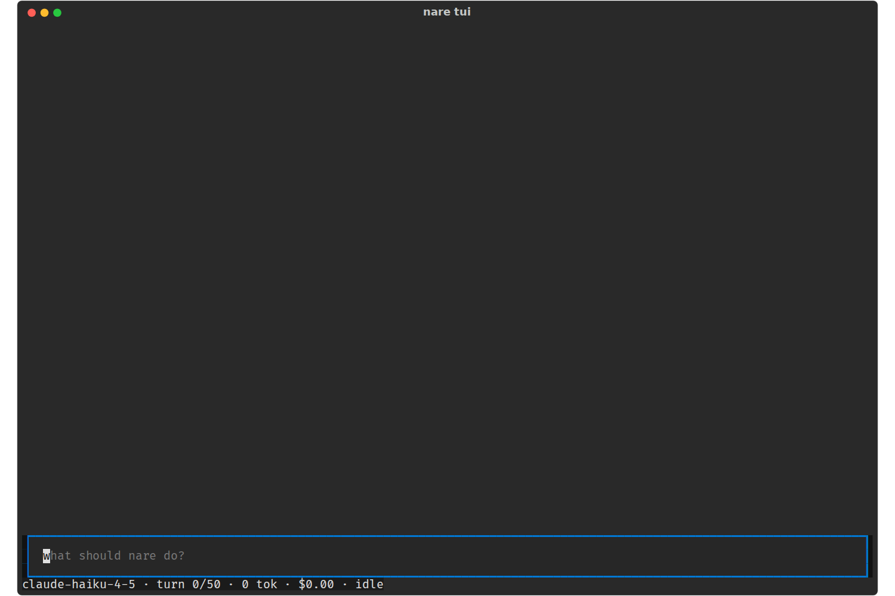
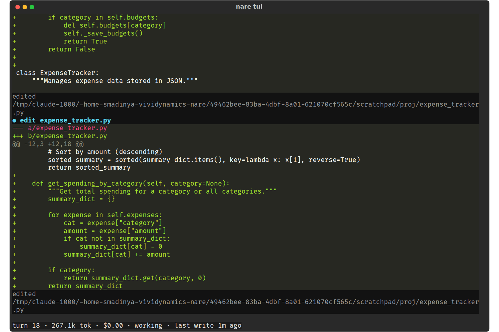

# nare - Session Lifecycle: Save Every Run, Say How to Resume

**Date:** 2026-10-08
**Status:** Draft for review
**Size:** S
**Scope:** `tui/app.py`, `cli.py`, `attach_status` in `tui/render.py`,
`session.py` and the README.
**Waits on:** nothing

The TUI should say where it is working when it opens, save every run outside the
project, leave the answer and a resume command behind when it closes, and record
an interrupt in the session file. Covers D1, C5 · V26, V25 and V27.

## 1. The problem

The start screen is blank apart from the input and the status bar.

This session was interrupted and closed a minute earlier, but `--attach` reports
it as working.

| ID | Severity | Issue |
| --- | --- | --- |
| D1 | High | The session file sat inside the project and got committed; without `--session`, nothing is saved. |
| C5 · V26 | Medium | Quitting prints nothing: no answer, session path or resume command. |
| V27 | Medium | Interrupted sessions are saved as `working`, so `--attach` shows a closed run as working. |
| V25 | Low | The start screen is blank: no model, root, session path or keys. |

Letters are IDs from the [practice-run
evidence](../../evidence/2026-10-08-tui-practice-run.md), which has the line
references at 89b4aa2. V numbers are from the visual review of 177e8fe, whose
screenshots are in
[2026-10-08-tui-visual-run](../../evidence/2026-10-08-tui-visual-run/). Where
both reviews found the same problem, the row carries both IDs.

## 2. Changes

1. Start line (V25): when the transcript starts empty, its first, dim line reads
   `nare 2026.10.x · claude-haiku-4-5 · root ~/proj · session ~/…/session.json`.
   With the default path from change 4, there is always a session path to show.
2. Exit summary (V26): after `app.run()` returns, print the last assistant text
   (its first 20 lines), the final status line, and
   `session: P · resume: nare tui --resume P`.
3. The interrupt survives in the file (V27). On cancel, set a new session field
   `interrupted_at` (an ISO timestamp, default `None`) and save; `reopen` clears
   it. `--attach` then shows `interrupted 2m ago` instead of `working`. A new
   session field with a default keeps contract version 2; a new status value
   would change the exit-code table and bump it.
4. A default session path (D1). Without `--session`, save to
   `$XDG_STATE_HOME/nare/sessions/<id>.json` and print the path on exit. Today
   Ctrl-Q without `--session` discards the whole run without a warning.
5. Warn when the session file is inside the project (D1): a notice, and a line
   on stderr, when the resolved path is under `--root` or the cwd. In the
   practice run, the agent's `git add -A` committed `session.json`, and finding
   it, ignoring it and amending took 4 turns (about 205k tokens).
6. README (D1): drop `--session s.json` from the `nare tui` example.

## 3. Acceptance

- [ ] A TUI started without a prompt shows the model, root and session path on
      its first line.
- [ ] After Ctrl-Q, the terminal shows the last answer and the resume command;
      without `--session` it prints the default path.
- [ ] Esc, then Ctrl-Q, writes `interrupted_at`. `--attach` on that file shows
      `interrupted`, and `--resume` clears the field.
- [ ] A session file written before this change still loads, with
      `interrupted_at` as `None`.
- [ ] `prepare()` with `--session` under `--root` warns; without `--session`,
      the XDG path exists after quit.

## 4. Related specs

The Transcript spec adds the on-screen interrupt marker (V23); this spec makes
the interrupt survive in the file.
