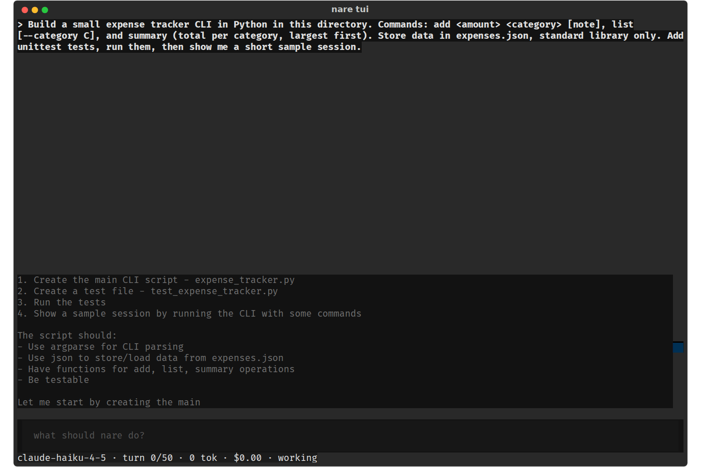
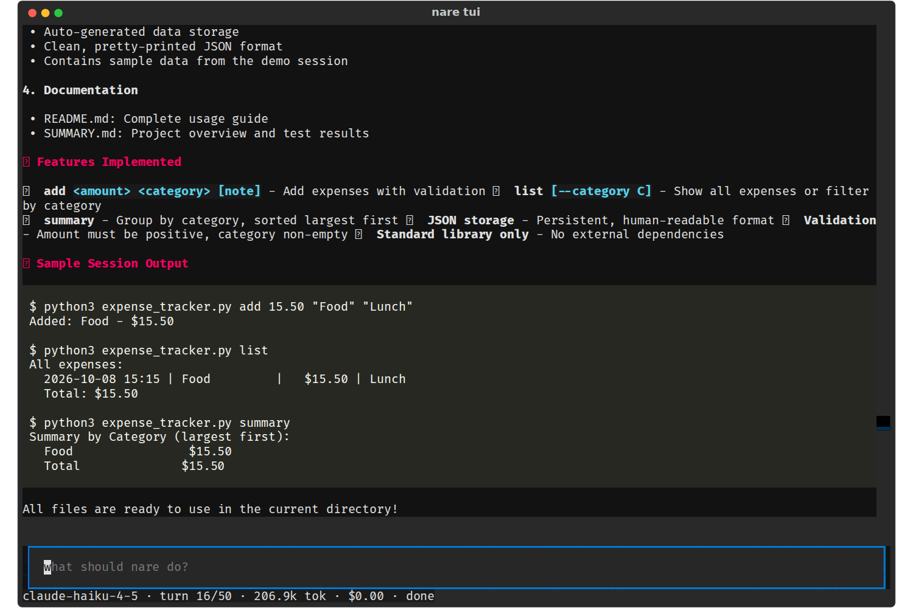

# nare - TUI Status Line: What Is Happening, in Plain Words

**Date:** 2026-10-08
**Status:** Draft for review
**Size:** S
**Scope:** `tui/app.py` and `tui/render.py`. A5's async bash, which this builds
on, is already in.
**Waits on:** the Turn limit and cost spec, for the cost figure.

While it works, the screen should show that something is happening, what it is,
and how far along the run is, in plain words. Covers V18 · A5, V20 · C3, V21,
V22, V24 and C1's turn colours. The cost figure comes from the Turn limit and
cost spec; this spec only displays it.

## 1. The problem

Mid-turn, the only sign of life is the word "working", and the disabled input
still invites you to type.

At the end: `done`, 207k tokens, $0.00.

| ID | Severity | Issue |
| --- | --- | --- |
| V18 · A5 | Medium | No spinner, elapsed time or running command; after `a`, a 600-second command showed only "working". |
| V20 · C3 | Medium | Counters mix scopes and show billed tokens, not context use. |
| V24 | Medium | No key hints, and PageUp does nothing while the input has focus. |
| V21 | Low | Internal status words: `blocked`, `awaiting approval`, `idle`. |
| V22 | Low | The disabled input still says "what should nare do?" |

C1's turn colours are change 7; C1 itself is tracked in the Turn limit and cost
spec.

Letters are IDs from the [practice-run
evidence](../../evidence/2026-10-08-tui-practice-run.md), which has the line
references at 89b4aa2. V numbers are from the visual review of 177e8fe, whose
screenshots are in
[2026-10-08-tui-visual-run](../../evidence/2026-10-08-tui-visual-run/). Where
both reviews found the same problem, the row carries both IDs.

## 2. Changes

1. Activity (V18): while busy, the status line shows a spinner and the current
   turn's elapsed time, redrawn by a 1-second `set_interval`. The approver runs
   before every call that isn't exempt, including always-allowed ones (A5), and
   sets `running bash 0:12 · python3 -m unittest`.
2. Cost (V19, display): show what accounting returns, with an estimate marked
   `~$0.30`. Until C2 lands, a streamed reply whose cost came only from
   `x-litellm-response-cost-original` shows `cost unknown`, not $0.00.
3. Labelled counters (V20): `turn 2/50 · ctx 28k/200k · 267k tok total`. The
   context figure is C3. The attach view uses the same labels and shows
   `18 turns` for the session.
4. Plain status words (V21): `idle` becomes `ready`, `awaiting approval` becomes
   `approve?`, `blocked` becomes `waiting for your answer`, and `error` shows
   its reason. `working`, `interrupted` and `done` stay.
5. Placeholder by state (V22): `working · esc to interrupt`,
   `answer the prompt above`, `interrupted · type to continue`, and the existing
   `answer the questions above`.
6. Keys (V24): PageUp, PageDown, Home and End scroll the transcript even while
   the input has focus. They become app-level bindings, which `Input` doesn't
   consume. When idle, the status bar ends with
   `enter send · esc interrupt · pgup scroll · ctrl+q quit`.
7. Turn colours (C1): the turn segment goes yellow at 80% of `--max-turns` and
   red at 90%. The practice run reached 48 of 50 behind a plain `turn 48/50`.

## 3. Acceptance

- [ ] During `sleep 30` through bash, the status line shows `running bash` and a
      ticking time (A5's test covers the kill).
- [ ] With the input focused, PageUp moves the transcript.
- [ ] `status_line` prints the plain words for each state, and the placeholder
      changes with the state.
- [ ] A streamed run through the proxy never shows $0.00 for a nonzero token
      count.
- [ ] `attach_status` and `status_line` use the same labels.
- [ ] `status_line` styles the turn segment yellow at 40/50 and red at 45/50.

## 4. Related specs

The Turn limit and cost spec computes the cost this spec shows (C2) and warns
the model before the cap (C1).
