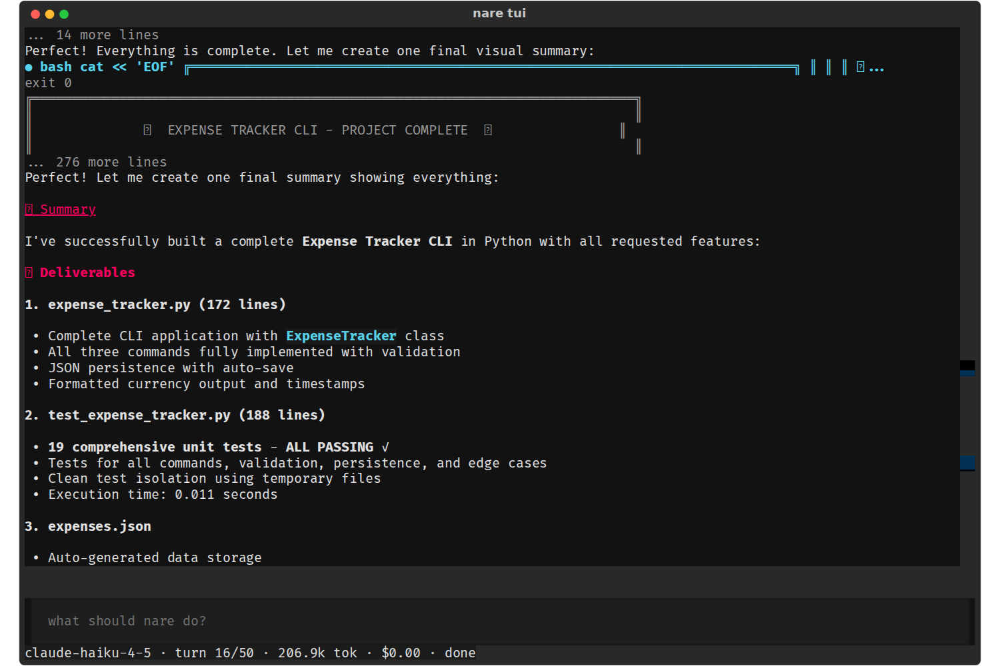

# nare - Steering: Type While the Agent Works

**Date:** 2026-10-08
**Status:** Draft for review
**Size:** M
**Scope:** `loop.py` (a new `run()` parameter) and `tui/app.py`.
**Waits on:** the System prompt spec.

You should be able to type while the agent works, and have it read your message
on its next turn. Covers V1. The System prompt spec (B1, rule 7) removes most of
the cause ("stay in scope; offer extras in the final message"); this spec is
your lever for what the prompt misses.

## 1. The problem

Six of the main run's turns 8 to 16 opened with "Perfect! Let me create one
final…", and two of them printed ASCII banners. Esc was the only way to stop it,
and Esc stops mid-edit.

| ID | Severity | Issue |
| --- | --- | --- |
| V1 | Medium | Unrequested wrap-up took 84% of the visual run's tokens, and Esc, a hard stop, is the only way to intervene. |

Letters are IDs from the [practice-run
evidence](../../evidence/2026-10-08-tui-practice-run.md), which has the line
references at 89b4aa2. V numbers are from the visual review of 177e8fe, whose
screenshots are in
[2026-10-08-tui-visual-run](../../evidence/2026-10-08-tui-visual-run/). Where
both reviews found the same problem, the row carries both IDs.

## 2. Changes

1. The input stays enabled while the agent works. Enter queues the text, and a
   dim line above the input shows `queued: stop, you're done`. Esc still stops
   the run at once.
2. `run()` takes an optional `inbox: Callable[[], list[str]]`. Before each step,
   the loop empties it and appends each item as a `text` block to the last user
   message, after its tool results, so the model reads it next turn. It is saved
   like any other message.
3. No new message shape is needed. `reopen` already merges text into a trailing
   user message, and both transports send it: Anthropic as text after the
   `tool_result` blocks, OpenAI as a `user` message after the `tool` messages
   (checked in `openai.messages_from`).
4. If the run ends with text still queued, the TUI sends it as an ordinary
   follow-up through `reopen`.

## 3. Acceptance

- [ ] Unit test: with "x" in the inbox, the next request's last user message
      ends with the text "x" after its tool results, on both transports.
- [ ] A message queued during a turn that ends `done` starts a follow-up run.
- [ ] `nare run`, which passes no inbox, behaves as before.
- [ ] Manual check: typing "stop and summarise" at turn 7 of the expense-tracker
      prompt ends the run within 2 turns, with no files written after it.

## 4. Related specs

Rule 7 of the System prompt spec removes most of the cause. The placeholder in
the Status line spec (V22) tells you the input is live.
