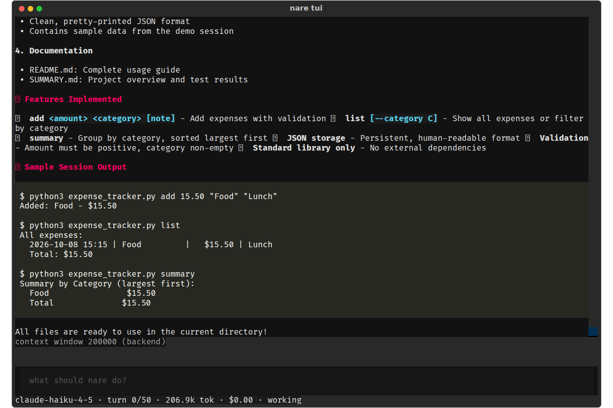
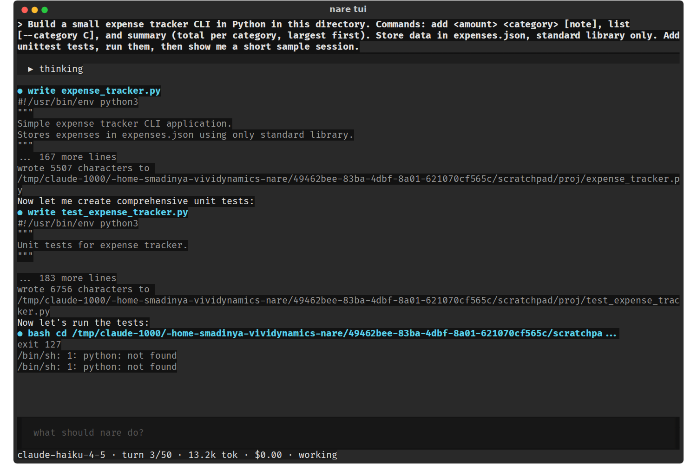
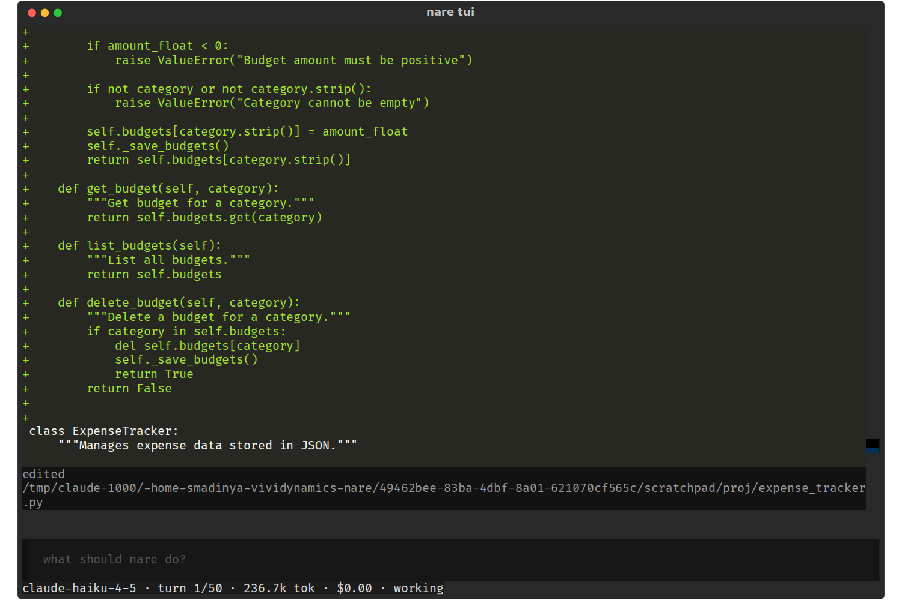

# nare - TUI Transcript: Newest in View, Failures as Failures

**Date:** 2026-10-08
**Status:** Draft for review
**Size:** M
**Scope:** `tui/app.py` and `tui/render.py`. S to M.
**Waits on:** nothing

The transcript should always show the newest thing, show failures as failures,
and give each step one or two lines. Covers V10 to V17, V23, V28 and C4.

## 1. The problem

Right after sending "Add budgets.", the prompt is off screen: the live pane grew
over the transcript's last lines.

`exit 127` and `python: not found` are the same dim grey as a success. The bash
header shows only the model's `cd /tmp/…` prefix, and each write result wraps
over three lines.

Edit diffs are never cut, so one edit fills the screen.

| ID | Severity | Issue |
| --- | --- | --- |
| V10 | High | Newest content is hidden: the live pane grows over the transcript's last lines, and a resize loses your place. |
| V11 · C4 | High | Failed commands look like successes: `exit 127` renders in the same dim grey as `exit 0`. |
| V28 | Medium | Every new block calls `scroll_end`, pulling you to the bottom while you read history. |
| V13 | Medium | Bash header lines show only the model's `cd /tmp/…` prefix; heredocs flatten into one line. |
| V23 | Medium | An interrupt leaves no mark in the transcript unless a call was waiting for approval. |
| C4 | Low | Context and compaction notices are cleared when the turn settles, and log warnings are short toasts. |
| V12 | Low | Write previews are cut to 5 lines, but edit diffs show in full. |
| V14 | Low | Results are noisy: "wrote 5507 characters to /tmp/…" wraps over 3 lines, and `read` prints file content. |
| V15 | Low | No spacing between assistant text and the previous tool output. |
| V16 | Low | `ask` renders as raw JSON plus an internal result line. |
| V17 | Low | Single newlines merge: a line-per-item list became one paragraph. |

Letters are IDs from the [practice-run
evidence](../../evidence/2026-10-08-tui-practice-run.md), which has the line
references at 89b4aa2. V numbers are from the visual review of 177e8fe, whose
screenshots are in
[2026-10-08-tui-visual-run](../../evidence/2026-10-08-tui-visual-run/). Where
both reviews found the same problem, the row carries both IDs.

## 2. Changes

1. Keep the newest content in view (V10, V28). Call `transcript.anchor()` in
   `on_mount`, as `#live` already does, and remove the `scroll_end` from
   `Transcript.add`. In a Textual 8.2.8 replica of this layout, the anchor kept
   the last line visible when the live pane grew and on a resize to 80×24;
   without it, both hid the line. The anchor lets go when you scroll up, so new
   blocks no longer pull you down. Sending a prompt calls `anchor()` again,
   which brings you back to the bottom (also checked in the replica).
2. Show failures as failures (V11): a result whose first line is `exit N` with N
   ≠ 0, or a signal exit, renders red, like `is_error`. This is the second half
   of C4.
3. Header lines show the command (V13). Pass the root into rendering and strip a
   leading `cd <root> &&` (relative or absolute) from the bash summary. A
   multi-line command shows its first line plus `(+N lines)` instead of folding
   newlines into spaces.
4. Compact results (V12, V14). Show paths relative to `--root`. A successful
   `write` reads `wrote expense_tracker.py (172 lines)`, and a successful `read`
   reads `read expense_tracker.py (243 lines)` with no content. Cap edit diffs
   at 20 lines with `… N more lines`, as writes are capped.
5. Spacing (V15): a blank line before each assistant text block, and a dim rule
   above each prompt you send.
6. `ask` (V16): render the call as `? asked 3 questions` and hide its success
   result, since the yellow panel shows the questions. Errors from `ask` still
   show.
7. Line breaks (V17): before `Markdown(...)`, turn single newlines outside code
   fences into hard breaks. Rich follows CommonMark, which joins them (checked:
   three lines rendered as one).
8. Interrupt marker (V23): when a run is cancelled, add a dim `— interrupted —`
   line. The Session lifecycle spec makes the state survive in the file.
9. Notices stay (C4). Context-window, compaction and log-warning notices go into
   the transcript as dim lines. Today they go to the live area, which clears
   when the turn settles, or to short toasts.

## 3. Acceptance

- [ ] Replica test: 60 blocks, then a 10-line live pane, then a resize to 80×24.
      The last block stays visible (fails today).
- [ ] After PageUp, a newly settled turn leaves the scroll offset where it was.
- [ ] A result starting `exit 127` renders red; `exit 0` renders dim.
- [ ] With root `/r`, the bash summary of `cd /r && python3 -m unittest` is
      `python3 -m unittest`; a 13-line heredoc shows its first line and
      `(+12 lines)`.
- [ ] A 60-line edit diff shows 20 lines and `… 40 more lines`.
- [ ] `"a\nb"` renders on two lines; a fenced code block is unchanged.
- [ ] Esc during a streamed turn leaves `— interrupted —` in the transcript.
- [ ] A compaction notice is still on screen after its turn settles.

## 4. Related specs

The Session lifecycle spec records the interrupt in the session file. The notice
in the Proxy warning spec relies on change 9 to stay on screen.
